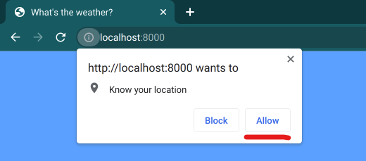

# Weather App

This is my version of the cool weather app. It is not a completely finished product but it should satisfy most of the mentioned features from the original README.md.  

## Prerequisites
* Docker and docker-compose installed on your machine, that's it!

## How to run
1. Run command line command `docker-compose up -d`
2. The service is now up and running!
    - Backend is now running in http://localhost:9000
    - And demo frontend in http://localhost:8000
3. Once you try to open http://localhost:8000 on your browser you get a prompt asking you to "allow it to know your location" and press "Allow". This makes sure it geolocation functions properly.

## Full Page example

## NB!
* Update button
* Google Cloud Free Trial ends: Ends November 15, 2022